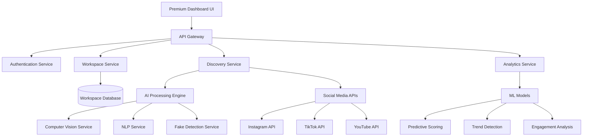

# Design Document - Skyline AI Influencer Discovery Platform

## Overview

Skyline is an AI-powered influencer discovery and vetting platform that provides curated insights for social media creators and brand alignment. The platform operates through intelligent workspaces that function as autonomous agents, continuously monitoring and analyzing relevant creators across multiple social media platforms.

### Key Design Principles
- **Workspace-Centric Architecture**: Each workspace operates as an independent discovery agent
- **AI-First Approach**: Leveraging computer vision, NLP, and predictive analytics for creator analysis
- **Premium User Experience**: Dark, luxury-focused interface with liquid glass design patterns
- **Cross-Platform Integration**: Unified analysis across Instagram, TikTok, and other social platforms
- **Real-Time Intelligence**: Continuous monitoring with predictive engagement scoring

## Architecture

### High-Level System Architecture



### Service Architecture
- **Frontend**: React-based SPA with premium dark theme and liquid glass components
- **Backend**: Node.js/Express microservices architecture
- **Database**: PostgreSQL for structured data, Redis for caching
- **AI Services**: Python-based services using OpenAI CLIP, custom ML models
- **Message Queue**: Redis/Bull for background job processing
- **External APIs**: Social media platform APIs with rate limiting and caching

## Components and Interfaces

### 1. Workspace Management System

**Purpose**: Manages independent discovery agents for different brands/niches

**Key Components**:
- Workspace Controller: CRUD operations for workspace management
- Agent Orchestrator: Manages independent discovery processes per workspace
- Brand Specification Parser: Processes and stores brand criteria

**Interfaces**:
```typescript
interface Workspace {
  id: string;
  name: string;
  brandSpecification: BrandSpec;
  targetNiche: string[];
  isActive: boolean;
  createdAt: Date;
  lastUpdated: Date;
}

interface BrandSpec {
  aestheticPreferences: AestheticCriteria;
  contentTypes: string[];
  targetAudience: AudienceCriteria;
  excludeKeywords: string[];
}
```

### 2. AI Discovery Engine

**Purpose**: Core AI system for creator discovery and analysis

**Key Components**:
- Computer Vision Service: CLIP-based aesthetic matching
- Content Analysis Service: NLP for content categorization
- Similarity Scoring Engine: Multi-factor creator similarity calculation
- Trend Detection Service: Real-time trend identification

**Interfaces**:
```typescript
interface CreatorProfile {
  id: string;
  platforms: PlatformData[];
  aestheticScore: number;
  engagementMetrics: EngagementData;
  authenticityScore: number;
  trendingScore: number;
  similarityReason: string;
}

interface AestheticAnalysis {
  colorPalette: string[];
  visualStyle: string;
  contentThemes: string[];
  similarityScore: number;
  visualComparison: ComparisonData;
}
```

### 3. Cross-Platform Data Aggregation

**Purpose**: Unified creator data across multiple social platforms

**Key Components**:
- Platform Adapters: Standardized interfaces for different social media APIs
- Data Normalizer: Converts platform-specific data to unified format
- Engagement Aggregator: Combines metrics across platforms
- Rate Limiter: Manages API quotas and prevents throttling

**Interfaces**:
```typescript
interface PlatformData {
  platform: 'instagram' | 'tiktok' | 'youtube';
  handle: string;
  followers: number;
  engagement: EngagementMetrics;
  recentContent: ContentItem[];
  growthTrend: GrowthData;
}

interface UnifiedMetrics {
  totalFollowers: number;
  avgEngagementRate: number;
  crossPlatformReach: number;
  strongestPlatform: string;
  audienceOverlap: number;
}
```

### 4. Authenticity & Vetting System

**Purpose**: Fake follower detection and engagement authenticity analysis

**Key Components**:
- Fake Follower Detector: ML-based suspicious account identification
- Engagement Pattern Analyzer: Identifies artificial engagement
- Authenticity Scorer: Composite authenticity rating
- Evidence Generator: Provides reasoning for authenticity scores

**Interfaces**:
```typescript
interface AuthenticityReport {
  overallScore: number; // 0-100
  fakeFollowerPercentage: number;
  suspiciousEngagement: SuspiciousPattern[];
  evidence: Evidence[];
  recommendation: 'high_risk' | 'medium_risk' | 'low_risk' | 'verified';
}

interface SuspiciousPattern {
  type: 'bot_comments' | 'engagement_spikes' | 'follower_quality';
  severity: number;
  description: string;
  evidence: string[];
}
```

### 5. Predictive Analytics Engine

**Purpose**: Trend detection and engagement prediction

**Key Components**:
- Growth Predictor: Forecasts creator growth potential
- Trend Detector: Identifies emerging content trends
- Engagement Predictor: Predicts future engagement rates
- Opportunity Scorer: Identifies rising creators before saturation

**Interfaces**:
```typescript
interface PredictiveInsights {
  growthPotential: number; // 0-100
  trendAlignment: TrendData[];
  predictedEngagement: EngagementForecast;
  opportunityScore: number;
  riskFactors: RiskFactor[];
}

interface TrendData {
  trendName: string;
  confidence: number;
  timeframe: string;
  relatedCreators: string[];
  contentExamples: ContentItem[];
}
```

## Data Models

### Core Entities

```typescript
// User and Workspace Models
interface User {
  id: string;
  email: string;
  subscription: 'free' | 'premium' | 'enterprise';
  workspaces: Workspace[];
  preferences: UserPreferences;
}

interface Workspace {
  id: string;
  userId: string;
  name: string;
  brandSpec: BrandSpecification;
  discoveredCreators: CreatorProfile[];
  isActive: boolean;
  agentSettings: AgentConfiguration;
}

// Creator and Content Models
interface CreatorProfile {
  id: string;
  platforms: PlatformPresence[];
  demographics: AudienceDemographics;
  contentAnalysis: ContentAnalysis;
  metrics: CreatorMetrics;
  authenticity: AuthenticityReport;
  predictions: PredictiveInsights;
}

interface ContentItem {
  id: string;
  platform: string;
  url: string;
  type: 'image' | 'video' | 'story';
  aestheticFeatures: AestheticFeatures;
  engagement: EngagementMetrics;
  timestamp: Date;
}

// Analytics Models
interface EngagementMetrics {
  likes: number;
  comments: number;
  shares: number;
  saves: number;
  rate: number;
  velocity: number;
}

interface AestheticFeatures {
  dominantColors: string[];
  visualStyle: string;
  composition: CompositionData;
  mood: string;
  clipEmbedding: number[];
}
```

### Database Schema Design

**PostgreSQL Tables**:
- `users` - User accounts and subscription info
- `workspaces` - Workspace configurations and brand specs
- `creators` - Creator profiles and cross-platform data
- `content_items` - Individual content pieces with analysis
- `authenticity_reports` - Fake follower and engagement analysis
- `trends` - Detected trends and their metadata
- `workspace_discoveries` - Many-to-many relationship between workspaces and creators

**Redis Cache Structure**:
- `creator:{id}` - Cached creator profiles (TTL: 1 hour)
- `trends:{niche}` - Trending content by niche (TTL: 30 minutes)
- `api_limits:{platform}:{user}` - API rate limiting counters

## Error Handling

### Error Categories and Strategies

1. **API Rate Limiting**
   - Implement exponential backoff for social media APIs
   - Queue requests when rate limits are hit
   - Provide user feedback on data freshness

2. **AI Service Failures**
   - Graceful degradation when computer vision services are unavailable
   - Fallback to cached similarity scores
   - Queue failed analyses for retry

3. **Data Quality Issues**
   - Validate social media data before processing
   - Handle private/deleted accounts gracefully
   - Provide confidence scores for all AI-generated insights

4. **User Experience Errors**
   - Clear error messages for workspace creation failures
   - Progressive loading states for AI analysis
   - Offline mode for cached data viewing

### Error Response Format
```typescript
interface ErrorResponse {
  error: {
    code: string;
    message: string;
    details?: any;
    retryable: boolean;
    timestamp: Date;
  };
}
```

## Testing Strategy

### Unit Testing
- **AI Services**: Mock external APIs, test algorithm accuracy with known datasets
- **Data Models**: Validate schema constraints and business logic
- **API Endpoints**: Test request/response handling and error cases

### Integration Testing
- **Social Media APIs**: Test with sandbox/test accounts
- **Database Operations**: Test complex queries and data consistency
- **Cross-Service Communication**: Verify message queue processing

### End-to-End Testing
- **Workspace Creation Flow**: Complete user journey from setup to discovery
- **Creator Analysis Pipeline**: Full AI processing workflow
- **Multi-Platform Data Aggregation**: Cross-platform data consistency

### Performance Testing
- **AI Processing Load**: Test with high-volume creator analysis
- **Database Query Performance**: Optimize complex analytical queries
- **API Response Times**: Ensure sub-second response for cached data

### AI Model Testing
- **Aesthetic Matching Accuracy**: A/B test similarity scoring against human judgment
- **Fake Follower Detection**: Validate against known fake account datasets
- **Trend Detection Precision**: Measure prediction accuracy over time

## Design Decisions and Rationales

### 1. Workspace-Centric Architecture
**Decision**: Each workspace operates as an independent agent with its own discovery process
**Rationale**: Allows users to manage multiple brands simultaneously without cross-contamination of recommendations. Enables specialized AI tuning per workspace.

### 2. Computer Vision for Aesthetic Matching
**Decision**: Use OpenAI CLIP for visual similarity analysis
**Rationale**: CLIP provides robust multi-modal understanding of images and text, enabling nuanced aesthetic matching beyond simple color/composition analysis.

### 3. Microservices Architecture
**Decision**: Separate services for discovery, analytics, and AI processing
**Rationale**: Enables independent scaling of compute-intensive AI services, better fault isolation, and easier maintenance of complex ML pipelines.

### 4. Real-Time vs Batch Processing
**Decision**: Hybrid approach with real-time trend detection and batch creator analysis
**Rationale**: Balances user experience (immediate trend alerts) with computational efficiency (batch processing for deep creator analysis).

### 5. Premium UI/UX Focus
**Decision**: Dark theme with liquid glass design patterns
**Rationale**: Creates differentiation from competitors, appeals to creative professionals, and supports the premium positioning strategy.

### 6. Cross-Platform Data Normalization
**Decision**: Unified data model across all social platforms
**Rationale**: Enables consistent comparison and analysis while abstracting platform-specific differences from the user interface.